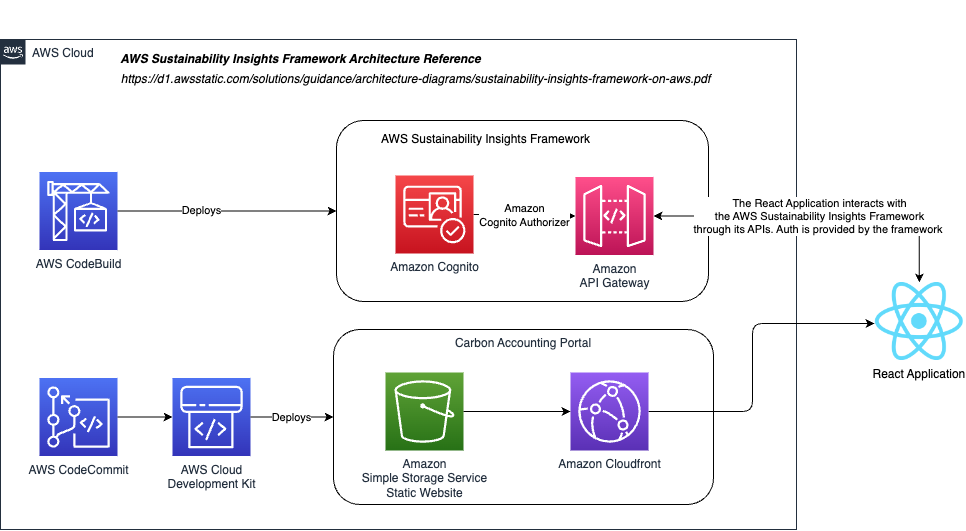

## AWS Sustainability Insights Framework Carbon Accounting Portal

The [AWS Sustainability Insights Framework (SIF)](https://github.com/aws-solutions-library-samples/guidance-for-aws-sustainability-insights-framework) Carbon Accounting Portal is a sample web application used for carbon accounting. It demonstrates how to set up a web application built on top of SIF. Follow the steps below to deploy the application:

### Architecture Diagram

### Configuration

1. Open the configuration file located in the project directory.
2. Create a `config.ts` file with the following details (see `config.ts.template` for a template):
   - `account`: Provide the AWS Account ID.
   - `region`: Specify the AWS Region Code.
   - `tenantId`: Set the TenantID as an alphanumeric string.
   - `adminEmail`: Enter the admin email address, which will be used for login and verification.
   - `environmentName`: Specify the deployment environment name.
3. Run `git add config.ts` to allow the build process in step 3 of **Backend Setup** to use the configuration file you just created. Note that you should not commit this to version control as it contains your account details.

### Frontend Setup

1. Open a terminal and navigate to the "frontend" directory.
2. Run `npm install` to install the required dependencies.
3. Run `npm run build` to build the frontend application.

### Backend Setup

1. Navigate back to the project root directory.
2. Run `npm install` to install the necessary dependencies.
3. Run `npm run build` to build the backend application.

### AWS CDK Deployment

1. Bootstrap the AWS CDK by running `cdk bootstrap` with an optional `--profile` parameter specifying the profile name if required.
2. Deploy the SifCodebuildStack by running `cdk deploy SifCodebuildStack` with an optional `--profile` parameter.
3. Start the build and deployment of SIF (Sustainable Infrastructure Framework) by running `aws codebuild start-build --project-name SifBuildDeploy` with an optional `--profile` parameter. This process may take up to an hour to complete.
4. Deploy the CarbonAccountingPortalPipeline by running `cdk deploy CarbonAccountingPortalPipeline` with an optional `--profile` parameter.

### Login and Password Reset

1. Upon completion of the build, you will receive an email with a temporary admin password.
2. Open the deployed web page.
   1. Navigate to the AWS Console.
   2. Go to the AWS CloudFormation page.
   3. Open the `<env_name>-CarbonAccountingPortalStack` stack.
   4. Locate the URL output from the **Outputs** tab.
   5. Open the Amazon CloudFront URL provided under **URL**. 
3. Follow the instructions to reset the password.
4. Navigate to the root directory of the project in the terminal.
5. Run `npm run configure-sif [NEW_PASSWORD]` to configure SIF with the new password. Replace `[NEW_PASSWORD]` with the desired password. If you are not using the default profile, make sure to export the credentials to the terminal.
   For example, if the new password is "john1hyhgtt," run `npm run configure-sif john1hyhgtt`.
6. If you get an error when running a calculation from the browser, try running the previous step again in case any resources failed to create.

The application is now ready to be used at its CloudFront URL.

### Reference Public Datasets
[US Environmental Protection Agency (EPA) Emissions & Generation Resource Integrated Database (eGRID) 2023](https://www.epa.gov/egrid/ "EPA Egrid")

[US EPA 2023 Total Output Emission Rate emission](https://www.epa.gov/egrid/data-explorer/ "EPA Egrid")

[Commercial Buildings Energy Consumption 2018 Survey (CBECS)](https://www.eia.gov/consumption/commercial/data/2018/ "CBECS")

### Resource Cleanup
To clean up all resources, you'll need to delete AWS CloudFormation Stacks. Failure to follow this step may result in charges to your AWS account. See below for stacks to delete:

- SifCodebuildStack
- CarbonAccountingPortalPipeline
- \<env-name\>-CarbonAccountingPortalStack
- sif-shared-\<env-name\>-platform
- all stacks starting with sif-\<tenant\>-\<env-name\>

To delete each stack,
1. Navigate to the AWS Console.
2. Go to the AWS CloudFormation page.
3. Click **Stacks** on the left side.
4. Select a stack.
5. Click **Delete**.
6. Confirm the deletion by clicking **Delete**.

### Disclaimer
Sample code, software libraries, command line tools, proofs of concept, templates, or other related technology are provided as AWS Content or Third-Party Content under the AWS Customer Agreement, or the relevant written agreement between you and AWS (whichever applies). You should not use this AWS Content or Third-Party Content in your production accounts, or on production or other critical data. You are responsible for testing, securing, and optimizing the AWS Content or Third-Party Content, such as sample code, as appropriate for production grade use based on your specific quality control practices and standards. Deploying AWS Content or Third-Party Content may incur AWS charges for creating or using AWS chargeable resources, such as running Amazon EC2 instances or using Amazon S3 storage.

This application is not designed to be used as-is in production.

### Security

See [CONTRIBUTING](CONTRIBUTING.md#security-issue-notifications) for more information.

### License

This library is licensed under the MIT-0 License. See the LICENSE file.
